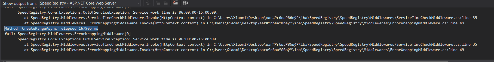
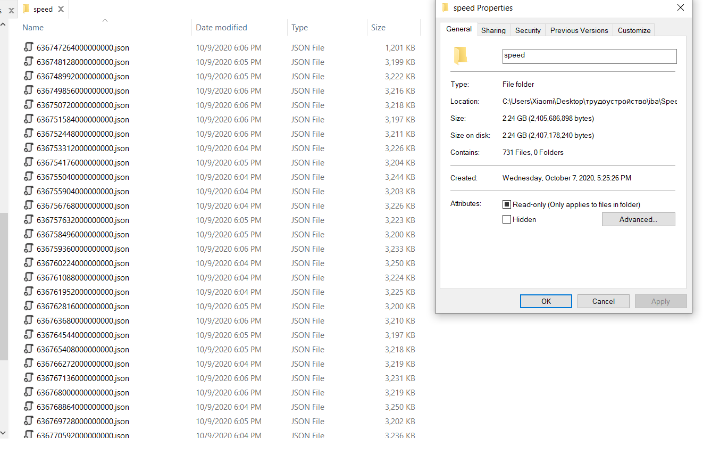
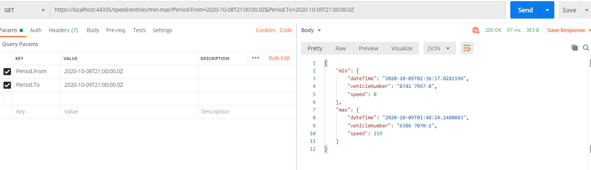
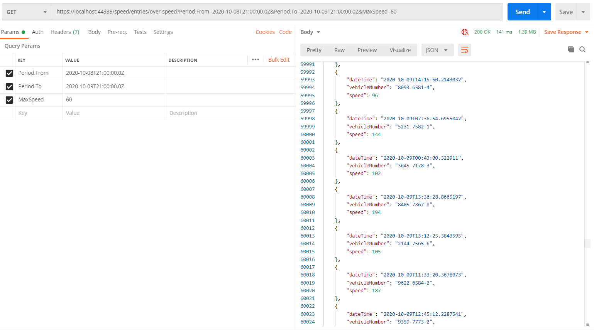
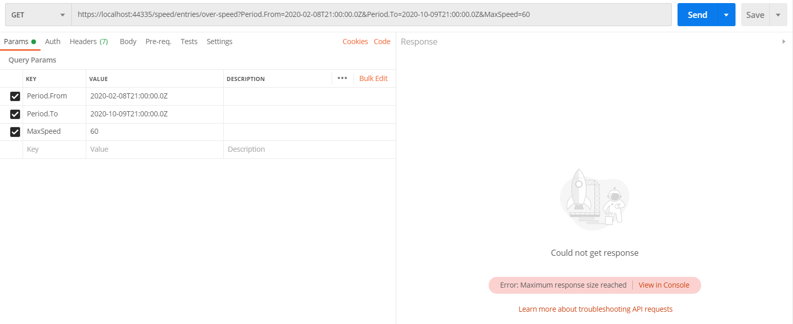
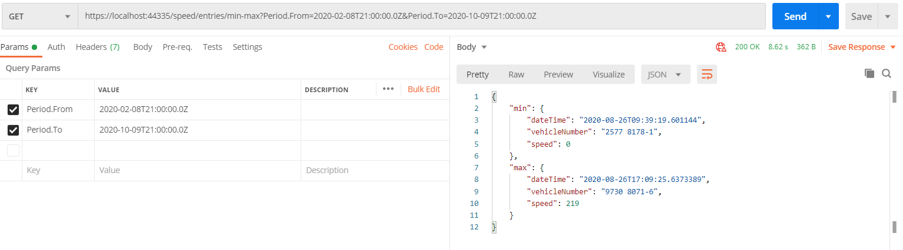
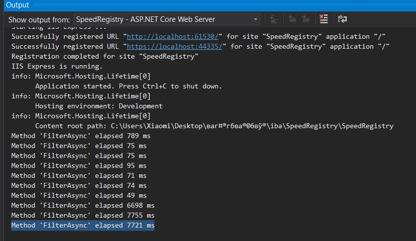

# SpeedRegistry
## Test data creation

## GET from one day request speed (as technical task asked to)

Method 'FilterAsync' elapsed 74 ms

Method 'FilterAsync' elapsed 49 ms
## Search over 8 months:

Method 'FilterAsync' elapsed 6698 ms

## Output

Method 'FilterAsync' elapsed 7721 ms

